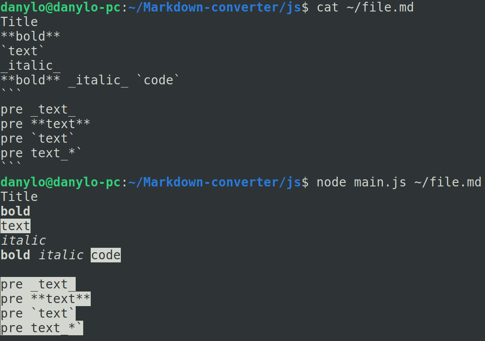

# Markdown-converter

Це простий консольний застосунок для конвертації синтаксису `Markdown` в синтаксис `ANSI Escape Codes` та `HTML`. 

Наразі наявна обмежена кількість тегів md, що конвертуються в  ansi та html. 

Застосунок підримує декілька варіантів виводу результатів конвертації:

- Вивід в консоль (stdout)
- Запис у файл

## Інструкція зі встановлення

1. Переконайтеся, що на вашій машині встановлено `Node.js`

Встановити його можна [тут](https://nodejs.org/en/download)

Або через термінал:

```bash
sudo apt install nodejs
```

2. Зклонуйте цей репозиторій на свою локальну машину та перейдіть до директорії, де знаходиться головний файл застосунку

```bash
git clone https://github.com/DanyloM73/Markdown-converter.git
```

```bash
cd Markdown-converter/js
```

**Тепер застосунок готовий до використання**

## Інструкція до використання

- Для того, щоб користуватись застосунком достатньо мати вказати шлях до файлу `.md`, за замовченням результат роботи застосунку виводиться у консоль (stdout) у форматі ansi

```bash
node main.js file.md
```

<p align="center">
  
</p>

- Також можна вказати файл, у який буде записана готова зконвертована розмітка у форматі html

```bash
node main.js file.md --out=file.html
```

<p align="center">
  
</p>

- Ще можна вказати конкретно формат конвертації markdown синтаксису

```bash
node main.js file.md --format=html
```

<p align="center">
  
</p>

- На даний момент застосунок підтримує не всі елементи розмітки Markdown. Ось перелік працюючих на даний момент розміток:

```**bold text**``` → ```<b>bold text</b>``` or ```\x1b[1mbold text\x1b[22m```

```_italic text_``` → ```<i>italic text</i>``` or ```\x1b[3mitalic text\x1b[23m```

``` `monospaced text` ``` → ```<tt>monospaced text</tt>``` or ```\x1b[7mmonospaced text\x1b[27m```

```
` ` `
Some
_Preformatted_
Text
` ` `
```

↓

```
<pre>
Some
_Preformatted_
Text
</pre>
```

or

```
\x1b[7m
Some
_Preformatted_
Text
\x1b[27m
```

```
Some ordinary text in paragraph1
Also paragraph1

Now we are in paragraph2
```

↓

```
<p>Some ordinary text in paragraph1
Also paragraph1</p>
<p>Now we are in paragraph2</p>
```

or

```
Some ordinary text in paragraph1
Also paragraph1

Now we are in paragraph2
```

- Також програма повідомляє користувача про знайдений помилковий синтаксис через stderr

<p align="center">
  
</p>

<p align="center">
  
</p>

## Додаткова інформація

Роботу виконав Маланін Данило, студент групи ІМ-21.

[Посилання на провалений тест](https://github.com/DanyloM73/Markdown-converter/commit/20efc235c3e0a5bf975db39e886f90e1ca191735)

[Посилання на revert-коміт](https://github.com/DanyloM73/Markdown-converter/commit/6875fdc3157166cf8234f7dd87d779bffe166b0e)

## Висновки

Загалом, для мене unit-тести виявились досить корисними, так, їх написання забирає певний час, але потім, у майбутньому ці ж тести дуже економлять час, адже тепер роботу застосунку не потрібно перевіряти вручну, оскільки це тепер можна зробити усього за допомогою однієї команди. Також цікавою і корисною для мене здалась сама концепція unit-тестування, це дозволяє набагато ефективніше тестувати застосунок, тестуючи окремі модулі, а не весь застосунок за раз.